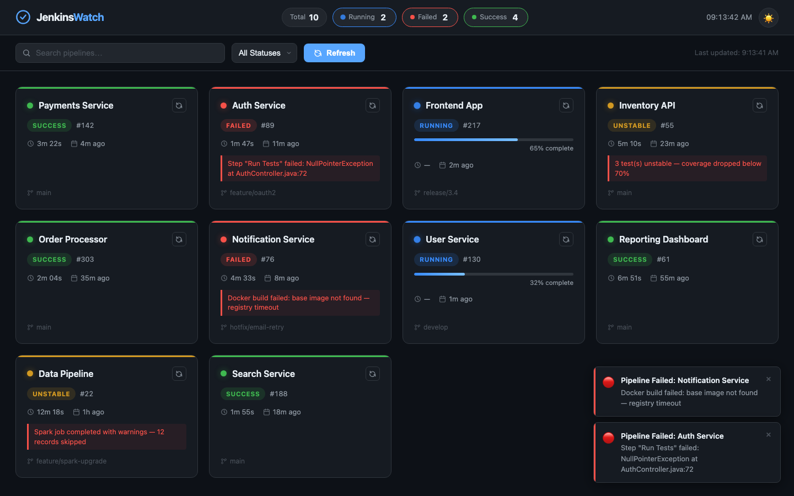
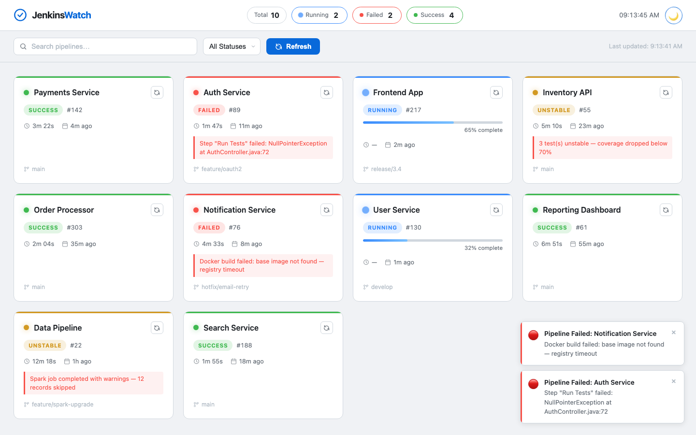
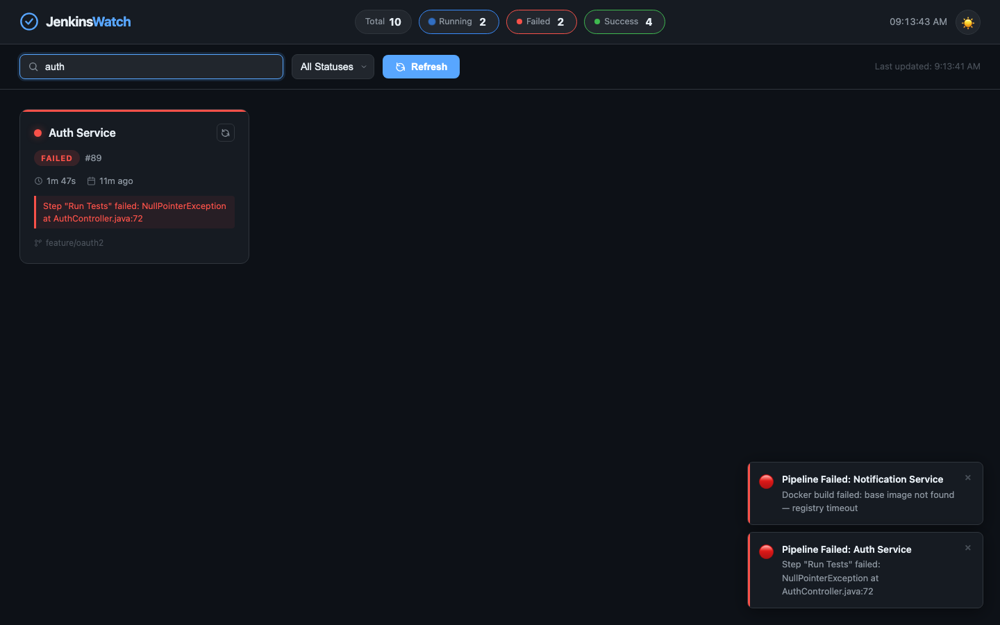

# JenkinsWatch — Jenkins Pipeline Dashboard

A modern, zero-dependency CI/CD monitoring dashboard built with plain HTML, CSS, and vanilla JavaScript. Displays all your Jenkins pipelines at a glance with live status, build info, failure alerts, and auto-refresh.

---

## Screenshots

### Dark Mode (default)


### Light Mode


### Search Filter


### Toast Failure Notifications


---

## Features

| Feature | Details |
|---|---|
| **Pipeline tiles** | Name, status, build number, duration, last-updated timestamp |
| **Status colors** | Green = Success · Red = Failed · Yellow = Unstable · Blue = Running |
| **Animated dots** | Pulsing dot on Running tiles |
| **Progress bar** | Live percentage bar on in-progress builds |
| **Failure message** | Short error excerpt shown directly on failed tiles |
| **Header stats** | Total / Running / Failed / Success counts at a glance |
| **Live clock** | Real-time clock in the header |
| **Auto-refresh** | Fetches new data every 30 seconds automatically |
| **Search** | Filter pipelines by name in real time |
| **Status filter** | Dropdown to show only Success / Failed / Running / Unstable |
| **Toast alerts** | Bottom-right notification when a pipeline fails |
| **Dark / Light mode** | Toggle with the ☀️ button; preference saved to `localStorage` |
| **Tile click** | Opens the Jenkins job URL in a new tab |
| **Per-tile refresh** | Refresh icon on each card re-fetches data immediately |
| **Keyboard accessible** | Tiles are focusable; `Enter`/`Space` opens the job URL |

---

## Project Structure

```
JenkinsAutomation/
├── index.html      # Page structure + tile template
├── style.css       # Dark/light theme tokens, layout, animations
├── app.js          # All dashboard logic (data, rendering, filters, toasts)
└── screenshots/    # UI screenshots used in this README
```

---

## How to Use

### 1. Run locally (no build step needed)

The dashboard is pure HTML/CSS/JS — just open it in a browser.

**Option A — double-click:**
Open `index.html` directly in any modern browser.

**Option B — local server (recommended, avoids CORS issues when you add real API calls):**
```bash
# Python
python3 -m http.server 8080

# Node (npx, no install)
npx serve . --listen 8080

# Then open:
# http://localhost:8080
```

---

### 2. Connect to a real Jenkins instance

All data logic lives in `DataService` inside `app.js`. The mock data is a drop-in replacement for a live API call.

**Step 1** — Open `app.js` and find `DataService.fetchPipelines()`:

```js
async fetchPipelines() {
  await DataService._delay(600);                        // ← remove this
  return DataService._simulateLiveUpdates([...MOCK_PIPELINES]); // ← replace with fetchFromJenkins()
},
```

**Step 2** — Uncomment `fetchFromJenkins` (already scaffolded in the file) and fill in your credentials:

```js
const JENKINS_BASE_URL = 'https://your-jenkins.example.com';
const token = btoa('your-user:your-api-token');         // Jenkins API token
```

> **Get your API token:** Jenkins → top-right avatar → Configure → API Token → Add new Token.

**Step 3** — If Jenkins is on a different origin, either:
- Enable CORS in Jenkins (`Manage Jenkins → Configure Global Security`), or
- Add a simple proxy (nginx, Caddy) that forwards `/jenkins-api/*` to your Jenkins host.

---

### 3. Adjust auto-refresh interval

In `app.js`, change `AUTO_REFRESH_MS` in the `App` object:

```js
AUTO_REFRESH_MS: 30_000,   // 30 seconds — change to any millisecond value
```

---

### 4. Add more pipelines (mock data)

Extend the `MOCK_PIPELINES` array at the top of `app.js`:

```js
{
  id: 'my-new-service',          // unique slug
  name: 'My New Service',        // display name
  status: 'success',             // 'success' | 'failed' | 'running' | 'unstable'
  buildNumber: 10,
  duration: '1m 30s',
  lastUpdated: new Date(),
  branch: 'main',
  url: 'https://jenkins.example.com/job/my-new-service/10/',
  message: null,                 // failure/warning text, or null
  progress: null,                // 0-100 for running jobs, or null
},
```

---

### 5. Toggle dark / light mode

Click the **☀️ / 🌙** button in the top-right corner. The preference is saved in `localStorage` and restored on next visit.

---

## Tech Stack

- **HTML5** — semantic markup, `<template>` element for tile cloning
- **CSS3** — custom properties (theme tokens), CSS Grid, keyframe animations
- **Vanilla JavaScript (ES2020)** — modular object-based architecture, no frameworks

## Browser Support

Works in all modern browsers: Chrome 90+, Firefox 88+, Safari 14+, Edge 90+.

---

## License

MIT
